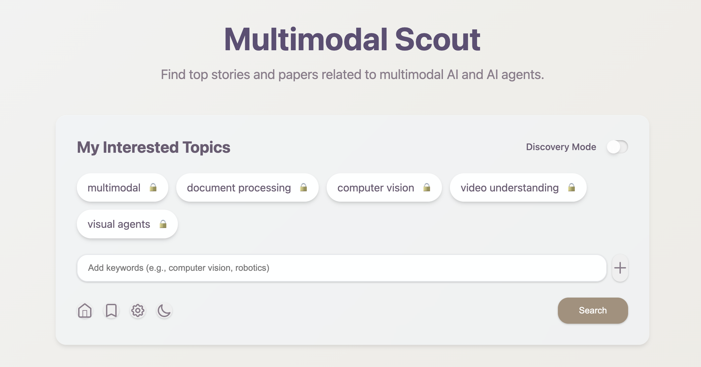

# Multimodal Scout

A smart content discovery platform that automatically finds, curates, and helps you bookmark the latest multimodal AI research papers and industry articles. Built with FastAPI, Next.js, and PostgreSQL, powered by Google Gemini AI.

**🌐 Live Demo**: [https://multimodal-scout.app/](https://multimodal-scout.app/)



## ✨ Features

- 🤖 **AI-Powered Curation**: Auto-discovers and summarizes multimodal AI research and industry content
- 🔍 **Smart Search**: Advanced filtering, real-time search, and "Discovery Mode" for exploration  
- 📚 **Personal Library**: Secure bookmarking with editing, export, and management
- 🌙 **Modern UI**: Clean, responsive interface with dark mode support
- ⚡ **Real-time Updates**: Live content processing with progress tracking

## 📚 Documentation

- 📖 **[User Guide](docs/user-guide.md)** - Complete walkthrough of all features and controls
- 🛠️ **[Development Guide](docs/development.md)** - Local setup, testing, and workflows
- 🔗 **[API Reference](docs/api.md)** - Complete REST API documentation
- ⏰ **[Automation Guide](docs/cron-jobs.md)** - Pipeline and content processing
- ☁️ **[Cloud Setup](GOOGLE_CLOUD_SETUP.md)** - Google Cloud deployment guide

## 🚀 Quick Start

### Prerequisites
- Docker and Docker Compose
- Google Gemini API key
- Google Cloud CLI (optional)

### Local Development

1. **Clone & Setup:**
   ```bash
   git clone https://github.com/yingzha/multimodal-scout.git
   cd multimodal-scout
   
   # Configure environment
   ./scripts/configure-env.sh local

   # Add your Gemini API key to .env
   ```

2. **Start All Services:**
   ```bash
   docker-compose up -d
   ```
   
   This launches:
   - 🗄️ **PostgreSQL** (port 5432)
   - 🖥️ **Backend API** (port 8000) 
   - 🌐 **Frontend** (port 3000)
   - ⏰ **Cron Pipeline** (every 30 min)

3. **Access Applications:**
   - **Main App**: http://localhost:3000
   - **API Docs**: http://localhost:8000/docs

### Production Deployment

1. **Prepare Environment:**
   ```bash
   # Configure for cloud deployment
   ./scripts/configure-env.sh cloud

   # Add your Gemini API to .env
   
   # Set up infrastructure (run once)
   ./setup-infrastructure.sh YOUR_PROJECT_ID us-central1
   ```

2. **Deploy Services:**
   ```bash
   # Build and deploy all services
   ./deploy-services.sh YOUR_PROJECT_ID us-central1
   ```

## 🏗️ Architecture

```
┌─────────────────────────────────────────────────────────────────────────┐
│                            Frontend (Next.js)                           │ 
│                     Real-time UI + Authentication                       │
└─────────────────────────┬───────────────────────────────────────────────┘
                          │ REST API + SSE
                          ▼
┌────────────────────────────────────────────────────────────────────────┐
│                            Backend (FastAPI)                            │
│                    API Endpoints + Pipeline Logic                       │
└─────┬─────────────────────────────┬─────────────────────────────────────┘
      │                             │
      ▼                             ▼
┌──────────────┐            ┌──────────────────┐
│  PostgreSQL  |            |    Google Gemini │
│   Database   │            │      AI API      │
│              │            │                  │
│ • Bookmarks  │            │ • Summarization  │
│ • Content    │            │ • Categorization │
│ • Users      │            │ • Smart Filters  │
│ • Cache      │            └──────────────────┘
└──────────────┘

┌─────────────────────────────────────────────────────────────────────────┐
│                         Automated Pipeline                              │
│                        (Every 30 minutes)                               │
│                                                                         │
│ Content Discovery  →  AI Processing  →  Storage & Indexing              │
│                                                                         │
│ • Hacker News         →  • Summarization   →  • PostgreSQL              │
│ • Substack Feeds      →  • Categorization  →  • Search Embeddings       │
│ • Hugging Face        →  • Quality Filter  →  • Cache Management        │
└─────────────────────────────────────────────────────────────────────────┘
```

## 🔧 Configuration

Switch between environments easily:

```bash
# Local development
./scripts/configure-env.sh local

# Cloud deployment  
./scripts/configure-env.sh cloud
```

## ☕ Support

If you find this project helpful, consider buying me a coffee to support continued development!

[](https://www.buymeacoffee.com/yingzh)
