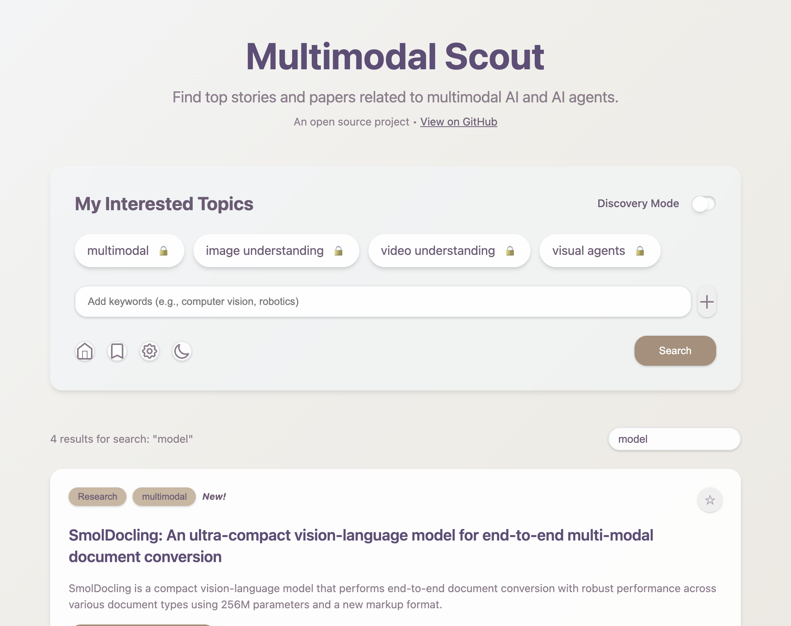

# Multimodal Scout

A smart content discovery platform that automatically finds, curates, and helps you bookmark the latest multimodal AI research papers and industry articles. Built with FastAPI, Next.js, and PostgreSQL. It runs entirely on your own machine, with summaries and search powered by an open source model served by [Ollama](https://ollama.com) or any OpenAI-compatible server.

> **Note:** The hosted demo has been shut down, and its former domain is no longer affiliated with this project. Multimodal Scout is now self-hosted only; follow the Quick Start below to run it locally.



## ✨ Features

- 🤖 **AI-Powered Curation**: Auto-discovers and summarizes multimodal AI research and industry content
- 💬 **HN Comment Insights**: Optional analysis of Hacker News discussions (off by default)
- 🔍 **Smart Search**: Advanced filtering, real-time search, and "Discovery Mode" for exploration  
- 📚 **Personal Library**: Bookmarking with editing, export, and management
- 🌙 **Modern UI**: Clean, responsive interface with dark mode support
- ⚡ **Real-time Updates**: Live content processing with progress tracking

## 📚 Documentation

- 📖 **[User Guide](docs/user-guide.md)** - Complete walkthrough of all features and controls
- 🛠️ **[Development Guide](docs/development.md)** - Local setup, testing, and workflows
- 🔗 **[API Reference](docs/api.md)** - Complete REST API documentation
- ⏰ **[Automation Guide](docs/cron.md)** - Pipeline and content processing

## 🚀 Quick Start

### Prerequisites
- Docker and Docker Compose
- [Ollama](https://ollama.com) running on the host, with one chat model and one embedding model:
  ```bash
  ollama pull gemma3:4b
  ollama pull bge-m3
  ```

### Run Locally

1. **Clone & Setup:**
   ```bash
   git clone https://github.com/yingzha/multimodal-scout.git
   cd multimodal-scout

   cp .env.example .env
   ```

2. **Start All Services:**
   ```bash
   docker-compose -f docker/docker-compose.yml up -d
   ```

   This launches:
   - 🗄️ **PostgreSQL** (internal to Docker)
   - 🖥️ **Backend API** (port 8000)
   - 🌐 **Frontend** (port 3000)
   - ⏰ **Pipeline** (every 30 min)

3. **Access Applications:**
   - **Main App**: http://localhost:3000
   - **API Docs**: http://localhost:8000/docs

The first pipeline run starts with the containers and fills the database; search returns results once it has finished.

The app runs as a single local user with no sign-in, and its ports are published on `127.0.0.1` only. Put your own authentication in front of it before exposing it to a network.

## 🏗️ Architecture

```
┌─────────────────────────────────────────────────────────────────────────┐
│                            Frontend (Next.js)                           │ 
│                              Real-time UI                               │
└─────────────────────────┬───────────────────────────────────────────────┘
                          │ REST API + SSE
                          ▼
┌─────────────────────────────────────────────────────────────────────────┐
│                            Backend (FastAPI)                            │
│                    API Endpoints + Pipeline Logic                       │
└─────┬─────────────────────────────┬─────────────────────────────────────┘
      │                             │
      ▼                             ▼
┌──────────────┐            ┌───────────────────┐
│  PostgreSQL  │            │     Local LLM     │
│   Database   │            │ (Ollama default)  │
│              │            │                   │
│ • Bookmarks  │            │ • Summarization   │
│ • Content    │            │ • Categorization  │
│ • Users      │            │ • Comment Insights│
│ • Cache      │            │ • Smart Filters   │
└──────────────┘            └───────────────────┘

┌─────────────────────────────────────────────────────────────────────────┐
│                         Automated Pipeline                              │
│                        (Every 30 minutes)                               │
│                                                                         │
│ Content Discovery  →  AI Processing  →  Storage & Indexing              │
│                                                                         │
│ • Hacker News         →  • Summarization   →  • PostgreSQL              │
│ • Substack Feeds      →  • Comment Insights →  • Search Embeddings      │
│ • Hugging Face        →  • Categorization  →  • Cache Management        │
│                       →  • Quality Filter  →  • 5-min TTL Caching       │
└─────────────────────────────────────────────────────────────────────────┘
```

## 🔧 Configuration

All settings live in `.env` (see `.env.example`):

| Variable | Default | Purpose |
|----------|---------|---------|
| `LLM_BASE_URL` | `http://host.docker.internal:11434/v1` | OpenAI-compatible API to use. Point it at LM Studio, llama.cpp, vLLM or a hosted provider to switch away from Ollama |
| `LLM_API_KEY` | `ollama` | API key sent to that server (Ollama ignores it) |
| `LLM_CHAT_MODEL` | `gemma3:4b` | Model for summaries and categorization |
| `LLM_EMBEDDING_MODEL` | `bge-m3` | Model for semantic search |
| `LOCAL_USER_EMAIL` | `local@localhost` | Owner of bookmarks and custom topics |

See the [Development Guide](docs/development.md) for the remaining options, including the search thresholds to re-tune when you change the embedding model.

## ☕ Support

If you find this project helpful, consider buying me a coffee to support continued development!

[](https://www.buymeacoffee.com/yingzh)
